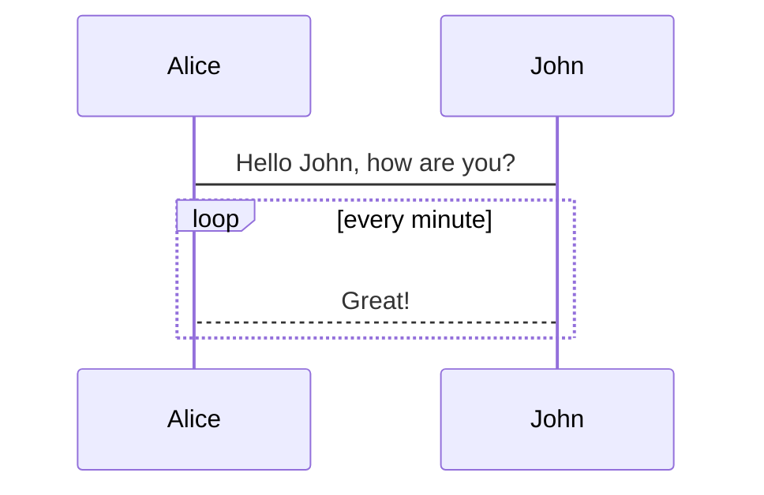

## About  
A knowledge base can be beneficial for businesses and organizations in many ways, including:  

:white_check_mark: **Centralized information**  
A knowledge base can store and organize important information and expertise in one place, such as customer support documentation, company policies, and product information. 

:white_check_mark: **Improved productivity**  
When employees can easily access the information they need to do their jobs, they can perform tasks more accurately and efficiently, which can reduce errors and improve productivity. 

:white_check_mark: **Streamlined onboarding**    
A knowledge base can simplify the onboarding process for new hires, which can help increase retention and reduce turnover. 

:white_check_mark: **Enhanced customer support**    
A knowledge base can help customers find answers quickly and efficiently, which can reduce the number of customer inquiries that agents need to handle manually.  

:white_check_mark: **Empowered customers**    
A knowledge base can provide customers with educational support materials so they can try to help themselves and solve challenges on their own.  

:white_check_mark: **Consistency and standardization**    
A knowledge base can ensure that the same information is presented to customers and employees consistently, and that procedures are standardized. It can also help ensure that information is accurate and up-to-date across the organization.  

:x: **No PII or PHI information**  
The guidance contained herein is a direct extension of **VA Directive 6102**, VA Internet and Intranet Services, and will be considered with the same authority.  

## Tools
This website is built using the following: 

:white_check_mark: [The Department of Veterans Affairs GitHub page](https://github.com/department-of-veterans-affairs), where this website and repository are hosted. 

:white_check_mark: [The VA Web Governance website](https://digital.va.gov/web-governance/), VA-approved development methods for employees and contractors building online content for the VA.  

:white_check_mark: [Markdown](https://www.markdownguide.org/), a lightweight markup language used to add formatting elements to plaintext text documents for easy contribution. 

:white_check_mark: [Docsify](https://docsify.js.org/), a documentation generator that loads and parses Markdown files, and displays them as a website. 

## Features
:white_check_mark: Powered by [plugins of docsify](https://docsify.js.org/#/plugins), and [community contributions](https://docsify.js.org/#/awesome?id=awesome-docsify-).

:white_check_mark: Full text search.  

:white_check_mark: Discover documents by hyperlinks of the documents you viewed, like a web spider.  

:white_check_mark: "Last updated at" indicator. 

:white_check_mark: Dark mode switch button.  

:white_check_mark: `==` highlight syntax support.  

:white_check_mark: LaTeX, mermaid.js, code highlight support.  

:white_check_mark: Custom font settings. 

:white_check_mark: Mobile responsive web design.  

:white_check_mark: User experience enhancement.  

:white_check_mark: Collapsable nested sidebar. 

:white_check_mark: Support [tabs syntax](https://jhildenbiddle.github.io/docsify-tabs/#/?id=usage).

## How to contribute
1. Check the list of open issues. Either assign an existing issue to yourself, or create a new one that you would like work on and discuss your ideas and use cases. 

2. Fork the repository on GitHub  

3. Create a topic branch from where you want to base your work. This is usually master.  

4. Make commits of logical units with explanatory commit messages.  

5. Push your changes to a topic branch in your fork of the repository.  

6. Open a new GitHub pull request with the code changes. 

7. Ensure the PR description clearly describes the problem and solution. Include the relevant issue number if applicable.  

8. Your contribution requires approval from one of the trusted committers.  

`Note:` GitHub.com repositories should **NOT** contain sensitive information of any kind

## New to GitHub?  
If you are not sure how to contribute you can follow this steps:  
1. Create a GitHub account.  
If you are not sure how to create a GitHub account get instructions [here](https://docs.github.com/en/get-started/start-your-journey/creating-an-account-on-github)

2. Fork a repository.  
A common way to contribute to a project on GitHub is to fork the repository, make changes, and then submit a pull request.
If you are not sure how to fork a repository get instructions [here](https://docs.github.com/en/pull-requests/collaborating-with-pull-requests/working-with-forks/fork-a-repo)  

3. Create a topic branch from master.  
A topic branch is a branch that is created from the main branch of a repository. It is used to work on a specific feature or bug fix without affecting the main branch.  
If you are not sure how to create a topic branch from master get instructions [here](https://github.com/Kunena/Kunena-Forum/wiki/Create-a-new-branch-with-git-and-manage-branches) 

4. Make some commits to improve the project.  
If you are not sure how to create commits get instructions [here](https://docs.github.com/en/pull-requests/committing-changes-to-your-project/creating-and-editing-commits/about-commits)  

5. Push this branch to your GitHub project.  
If you are not sure how to push a branch to your GitHub project get instructions [here](https://docs.github.com/en/get-started/using-git/pushing-commits-to-a-remote-repository)  

6. Open a Pull Request on GitHub.  
If you are not sure how to create pr open a pull request get instructions [here](https://docs.github.com/en/pull-requests/collaborating-with-pull-requests/proposing-changes-to-your-work-with-pull-requests/creating-a-pull-request)  

7. Discuss, and optionally continue committing.  

8. The project owner merges or closes the Pull Request.

## Requesting Access to GitHub

Guides for requesting access to the Department of Veterans Affairs GitHub Enterprise Cloud and GitHub Enterprise Managed Users enterprises.  
- GitHub Enterprise Cloud is the SaaS offering from GitHub.com. This enterprise contains a single GitHub organization named [Department of Veterans Affairs](https://github.com/department-of-veterans-affairs).  
- All public and open-source projects must be developed in this enterprise.  
- This is the legacy GitHub Enterprise Cloud environment for non-public repositories. It is possible that your existing project may be in this enterprise. Consult with your project manager to determine if this is the correct enterprise for your existing project.  
- Request access to this instance by following these instructions: [Requesting access to the GitHub Enterprise Cloud](https://department-of-veterans-affairs.github.io/github-handbook/guides/onboarding/getting-access/ghec)  

## Did you find a bug?
- Reporting bugs is one of the best ways to contribute. Be sure the bug was not already reported by searching on GitHub under Issues.  

- If you're unable to find an open issue addressing the problem, open a new one. Be sure to include a title and clear description, as much relevant information as possible, and a code sample or an executable test case demonstrating the expected behavior that is not occurring.  

## New to Markdown?  
Markdown is a lightweight markup language for creating formatted text using a plain-text editor. If you are not sure how to get started with Markdown get instructions [here](https://www.markdownguide.org/)  

## Markdown Syntax Test

~~deleted~~

==hightlight==

$a^2+b^2=c^2$

$$
a^2+b^2=c^2
$$

:star:



```python
for i in range(42):
    print("calm down")
```
## Aproval  
This web application was approved on 07/17/2024 by the ISSO (Information System Security Office) Department at the Captain James A. Lovell Federal Health Care Center.  

## Thanks 

I appreciate your help and support!
